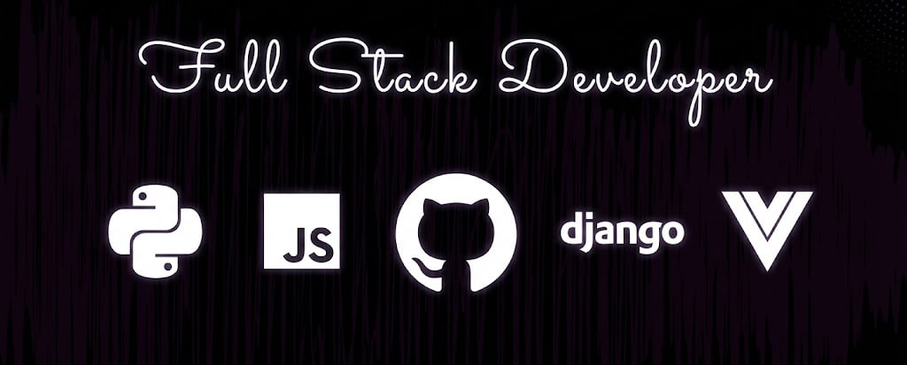

  

# 👨‍💻 Whoami

I am **Golibjon Abduxalilov**, a passionate **Python Backend & JavaScript Frontend Developer** from **Uzbekistan 🇺🇿**.  
A highly resourceful programmer with deep interest in building scalable backend systems and beautiful, responsive frontends.

I have experience working with modern backend technologies such as **Django, REST APIs, PostgreSQL**, and frontend frameworks like **Vue.js**.  
I love problem-solving, clean code, and continuous learning.

---

# 🔭 Tools of Trade

Here are the tools and technologies I use in my development workflow:

### 🧰 Languages, Frameworks & Platforms

  
  
  
  

### ⚙️ Tools & Other Technologies
TailwindCSS • Docker • Git • GitHub • Postman • PostgreSQL • Nginx • Vercel • Linux

---

# 📫 Reach me on

---

# 💻 Check Out My Repos ⬇️

  

